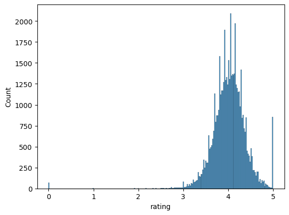
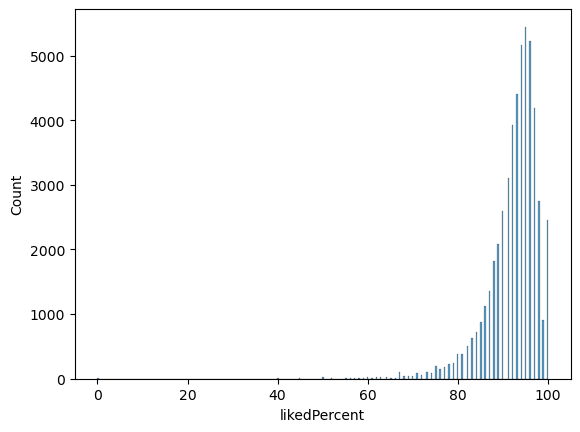
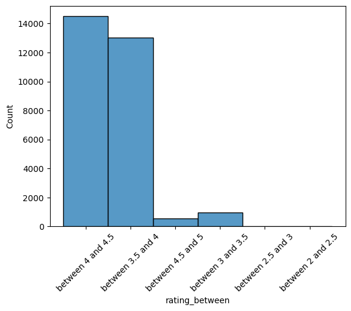
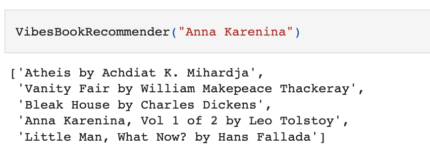
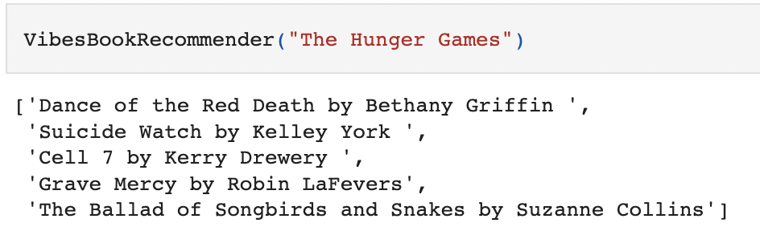

# Book-Recommendation-Engine


## Business Problem

The worst thing is finishing a book and not knowing what to read next! That's why I've built a book recommendation engine. Using data like average reader rating, genres, and series, my recommendation engine gives you five books to read next for every one you put in.

## Overview

The data comes from Kaggle. I first used a K Nearest Neighbors using ball tree due to the amount of rows (nearly 29k) and columns (about 120). Following this, I made a bag of words with all text data and used Natural Language Processing to create an even smarter recommender. I tried both Count Vectorizer and TF-IDF. Count Vectorizer gave better suggestions.

Overall the recommendations the engine gives are pretty good, but could be improved with more data and more recent book releases.

## Data Understanding

The dataset contains information on thousands of books, including title, author, publisher, year of release, number of pages, and more.

Exploratory data analysis finds that reader ratings average between 3.5-4.5 out of 5 total. "LikedPercent," (e.g. the amount of people who say they liked the book) is also around 90% for most of the books in the set. These two categories have a 80% correlation, so we're just going to use "rating" in our engine.





## Final Results

It works pretty well!




## Conclusion & Next Steps

In the end, the book recommendation engine gives you some pretty good suggestions for the books you put in. But there are still a few kinks to work out:

- Sometimes the recommendation engine gives you the whole series as a suggestion or a re-issue, this seems a bit obvious. We can clean up the dataset further to remove box sets or re-issues.
- Despite the size of the dataset (29k at the end of cleaning), there are still a lot of books that this system doesn't have. We can update it with more recent book releases, especially modern classics and bestsellers.
- It'd be nice to know what genres the recommendations are falling into to give the user more to explore. We can add to the for loop to allow for this.
And finally, wouldn't it be nice to have an app or pretty front-end to make all of this more accessible for users? That's coming right up!


## Repository Structure
```
├── data
├── images
├── README.md
└── Recommendation_Engine_Notebook.ipynb
```
